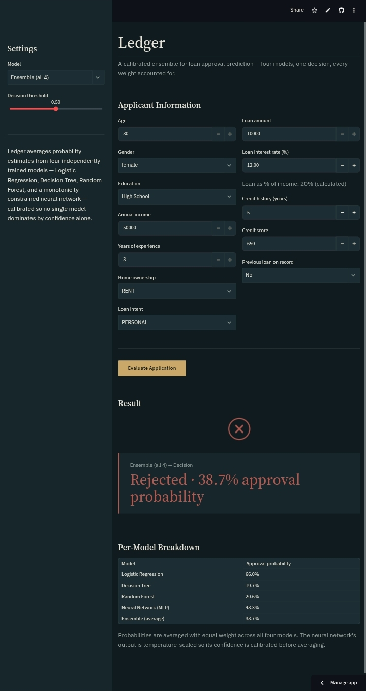
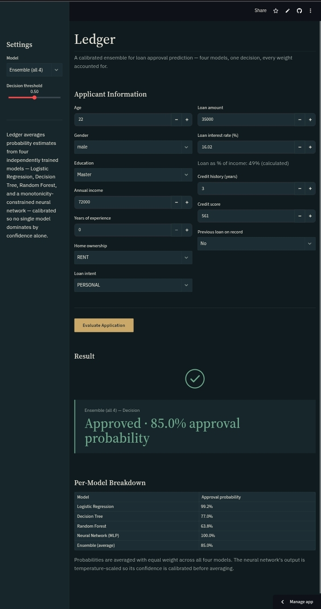
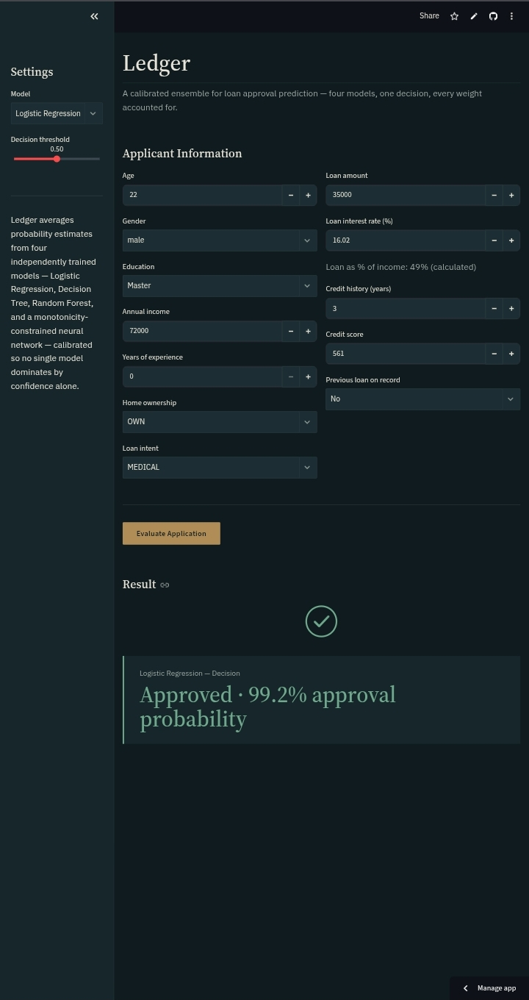
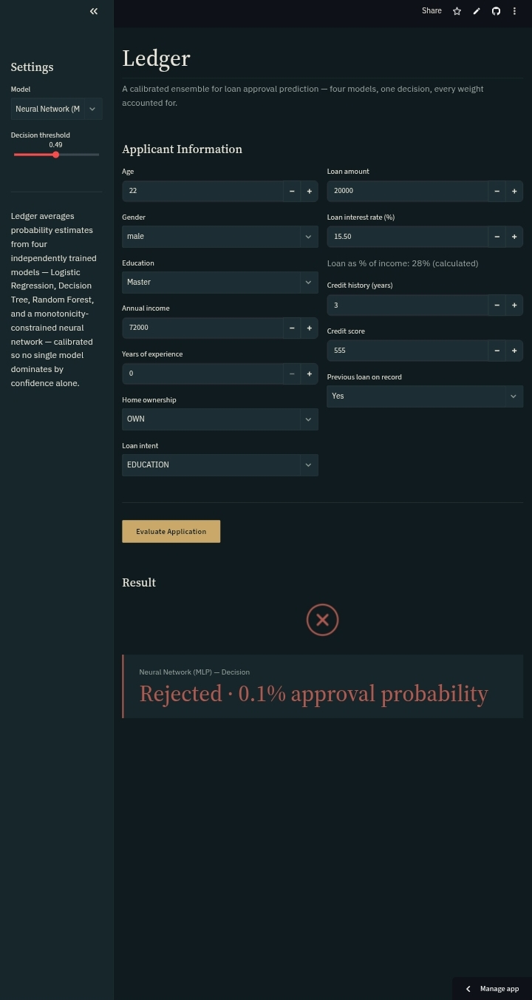
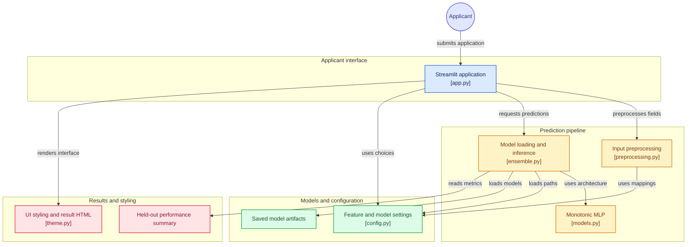
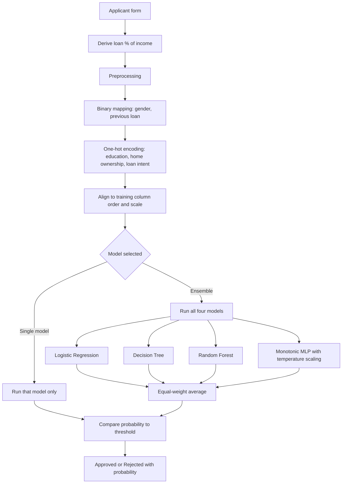

# Ledger

<p align="left">
  <a href="https://pypcoder-ledger.streamlit.app/"></a>
  
  
  
  
  
  
</p>

**A calibrated, monotonicity-constrained ensemble for loan approval prediction.**

Ledger takes an applicant's details and returns an approval probability and an Approved or Rejected decision. Four independently trained models are combined by equal-weight soft voting. The neural network is temperature-scaled so its probabilities are calibrated before averaging, and its income and credit score pathway is constrained so that a higher value can never lower the predicted approval probability.

**Live app:** https://pypcoder-ledger.streamlit.app/

Built as the capstone project of a remote AI/ML internship at Big Brains.

---

## Features

- Four models: Logistic Regression, Decision Tree, Random Forest, and a custom neural network
- Equal-weight soft-voting ensemble across all four
- Temperature scaling on the neural network so equal weighting is fair
- Monotonicity constraint on `person_income` and `credit_score`, checked with a sweep test (see Training)
- Model selector: the ensemble, or any single model (only the selected model runs)
- Adjustable decision threshold
- Loan-to-income ratio calculated automatically from the loan amount and income
- Per-model probability breakdown when the ensemble is selected
- Dark ink, bone and brass interface with a result animation for approvals and rejections

## Screenshots

<table>
  <tr>
    <td align="center"></td>
    <td align="center"></td>
  </tr>
  <tr>
    <td align="center"><sub>Ensemble: Rejected (38.7%), with the per-model breakdown</sub></td>
    <td align="center"><sub>Ensemble: Approved (85.0%), with the per-model breakdown</sub></td>
  </tr>
  <tr>
    <td align="center"></td>
    <td align="center"></td>
  </tr>
  <tr>
    <td align="center"><sub>Single model (Logistic Regression): Approved (99.2%)</sub></td>
    <td align="center"><sub>Single model (Neural Network): Rejected (0.1%)</sub></td>
  </tr>
</table>

## How it works

### Code architecture

How the app is organised: the interface calls preprocessing and the ensemble module, which loads the saved artifacts and shared configuration.



<details>
<summary>Detailed view with every saved artifact</summary>



</details>

```mermaid
flowchart TD

subgraph group_interface["Applicant interface"]
  node_application_ui["Application UI<br/>[app.py]"]
  node_decision_display["Decision display<br/>[app.py]"]
  node_theme["Visual design<br/>[theme.py]"]
end

subgraph group_preparation["Input preparation"]
  node_preprocessing["Input preprocessing<br/>[preprocessing.py]"]
  node_configuration["Feature configuration<br/>[config.py]"]
end

subgraph group_inference["Prediction engine"]
  node_ensemble["Ensemble inference<br/>[ensemble.py]"]
  node_mlp_architecture["Monotonic MLP<br/>[models.py]"]
end

subgraph group_artifacts["Saved model assets"]
  node_logistic_model["Logistic regression"]
  node_tree_model["Decision tree"]
  node_forest_model["Random forest"]
  node_mlp_weights["MLP weights<br/>[mlp.pt]"]
  node_scaler["Feature scaler<br/>[scaler.joblib]"]
  node_feature_columns["Feature columns"]
  node_monotonic_mask["Monotonic mask"]
end

node_applicant(("Applicant"))

node_applicant -->|"enters details"| node_application_ui
node_application_ui -->|"preprocesses input"| node_preprocessing
node_preprocessing -->|"uses feature rules"| node_configuration
node_application_ui -->|"requests prediction"| node_ensemble
node_application_ui -->|"renders decision"| node_decision_display
node_application_ui -->|"uses presentation helpers"| node_theme
node_ensemble -->|"reads asset paths"| node_configuration
node_ensemble -->|"instantiates network"| node_mlp_architecture
node_ensemble -->|"loads model"| node_logistic_model
node_ensemble -->|"loads model"| node_tree_model
node_ensemble -->|"loads model"| node_forest_model
node_ensemble -->|"loads weights"| node_mlp_weights
node_ensemble -->|"loads scaler"| node_scaler
node_ensemble -->|"loads columns"| node_feature_columns
node_ensemble -->|"loads mask"| node_monotonic_mask

classDef toneBlue fill:#dbeafe,stroke:#2563eb,stroke-width:1.5px,color:#172554
classDef toneAmber fill:#fef3c7,stroke:#d97706,stroke-width:1.5px,color:#78350f
classDef toneMint fill:#dcfce7,stroke:#16a34a,stroke-width:1.5px,color:#14532d
classDef toneRose fill:#ffe4e6,stroke:#e11d48,stroke-width:1.5px,color:#881337
classDef toneIndigo fill:#e0e7ff,stroke:#4f46e5,stroke-width:1.5px,color:#312e81
class node_application_ui,node_decision_display,node_theme toneBlue
class node_preprocessing,node_configuration toneAmber
class node_ensemble,node_mlp_architecture toneMint
class node_logistic_model,node_tree_model,node_forest_model,node_mlp_weights,node_scaler,node_feature_columns,node_monotonic_mask toneRose
class node_applicant toneIndigo
```

### Prediction flow



### The monotonic neural network

A standard network cannot guarantee that a higher income never lowers the approval probability, because later layers can flip the sign of an earlier constrained layer. Ledger splits the input instead:

- `person_income` and `credit_score` go through a small sub-network where every weight, in every layer, is passed through `softplus` so it is non-negative. With ReLU (non-decreasing) between layers, this pathway can only increase as these features increase.
- All other features go through a normal unconstrained MLP.
- The two pathways are summed to form the final logit, which is then divided by a learned temperature for calibration.

An earlier version constrained only the first layer. It failed the monotonicity sweep for both features, which is what led to this design.

## Dataset

[Loan Approval Dataset](https://www.kaggle.com/datasets/muhammadmusharraf444/loan-approval-dataset) (Kaggle): 45,000 applications, 14 columns, no missing values or duplicates. About 22% of applications are approved.

Notes from exploratory analysis:

- `previous_loan` is the dominant signal (correlation -0.54 with approval). No application with a previous loan on record is approved.
- `loan_percentage` (0.38) and `loan_interest_rate` (0.33) are the next strongest.
- `credit_score` and `credit_history` show almost no linear correlation with approval.

## Results

Evaluated on a stratified 20% hold-out set (9,000 applications). Precision, recall and F1 are for the Approved class.

| Model | Accuracy | Precision | Recall | F1 | ROC-AUC |
|---|---|---|---|---|---|
| Logistic Regression | 89.98% | 78.96% | 74.85% | 76.85% | 0.956 |
| Decision Tree | 90.98% | 85.61% | 71.40% | 77.86% | 0.943 |
| Random Forest | 91.70% | 91.35% | 69.20% | 78.75% | 0.964 |
| Neural Network (calibrated) | 91.39% | 84.86% | 74.55% | 79.37% | 0.965 |
| **Ensemble (equal-weight)** | **91.94%** | 88.29% | 73.50% | **80.22%** | **0.968** |

The ensemble has the best accuracy, F1 and ROC-AUC. Random Forest has the highest precision.

## Project structure

```
Ledger/
├── app.py              # Streamlit interface
├── config.py           # Paths, column lists, dropdown options, constants
├── models.py           # MonotonicMLP architecture
├── preprocessing.py    # Single-applicant preprocessing for inference
├── ensemble.py         # Model loading, single-model and soft-voting prediction
├── theme.py            # Interface styling and result animation
├── visuals/            # README screenshots
├── Ledger.ipynb        # Training notebook: EDA, training, evaluation, saving
├── requirements.txt
├── .gitignore
└── models_saved/       # Trained models, scaler, feature order, monotonic mask
```

## Run locally

```bash
git clone https://github.com/PypCoder/Ledger.git
cd Ledger
pip install -r requirements.txt
streamlit run app.py
```

The trained artifacts are included in `models_saved/`, so no training is needed to run the app.

## Training

Training is done in [`Ledger.ipynb`](Ledger.ipynb), which covers EDA, preprocessing, all four models, temperature scaling, the monotonicity check, evaluation, and saving the artifacts to `models_saved/`. Preprocessing in `preprocessing.py` mirrors the notebook exactly, so live inputs are transformed the same way as the training data.

- Split: 80% train and 20% test, stratified, `random_state=42`
- Logistic Regression: `max_iter=1000`
- Decision Tree: `max_depth=4`
- Random Forest: 50 trees, `max_depth=6`
- The three scikit-learn models are fitted on the full standardized training set.
- Neural network: full-batch training for 500 epochs with Adam (learning rate 0.01) and binary cross-entropy, on 85% of the training set. The other 15% is a validation slice used to fit the temperature (1.0687) with L-BFGS.

### Reproduce the training

1. Download `loan_data.csv` from the [Kaggle dataset](https://www.kaggle.com/datasets/muhammadmusharraf444/loan-approval-dataset).
2. Open `Ledger.ipynb` in Google Colab or Jupyter and place `loan_data.csv` in the same folder as the notebook.
3. Run all cells from top to bottom. The first cell installs the required packages, including matplotlib and seaborn for the plots.
4. The notebook writes the trained models, scaler, feature order, monotonic mask and `results_summary.csv` to `models_saved/`. Copy that folder into the repository root and run the app.

Retraining with a different scikit-learn or PyTorch version can change the saved files slightly, so results may differ in the last decimal places.

### Monotonicity check

The check sweeps each constrained feature across the scaled range -3 to 3 for one reference applicant and confirms the predicted probability never decreases. Both features pass, but the results differ:

- `credit_score`: probability rises from 0.606 to 0.928 across the sweep.
- `person_income`: probability stays flat at 0.606, so the constraint holds trivially. The network learned no positive effect of income, which is consistent with income having a weak, slightly negative correlation with approval in this dataset.

## Limitations

- The dataset looks synthetic. Its patterns (for example, higher loan share and interest rate associated with approval, and no approvals at all with a previous loan) do not reflect real lending practice, so the model should not be used for real credit decisions.
- Inputs outside the training range (for example loan amounts above 35,000, or loan share above 66% of income) are extrapolations.
- Gender is an input because it is in the dataset. A real lender should not use it, and no fairness analysis is included in this version.

## Tech stack

- Python
- scikit-learn
- PyTorch
- pandas
- NumPy
- joblib
- Streamlit

---

<div align="center">
  <a href="https://github.com/PypCoder" target="_blank">
    
  </a>
</div>
